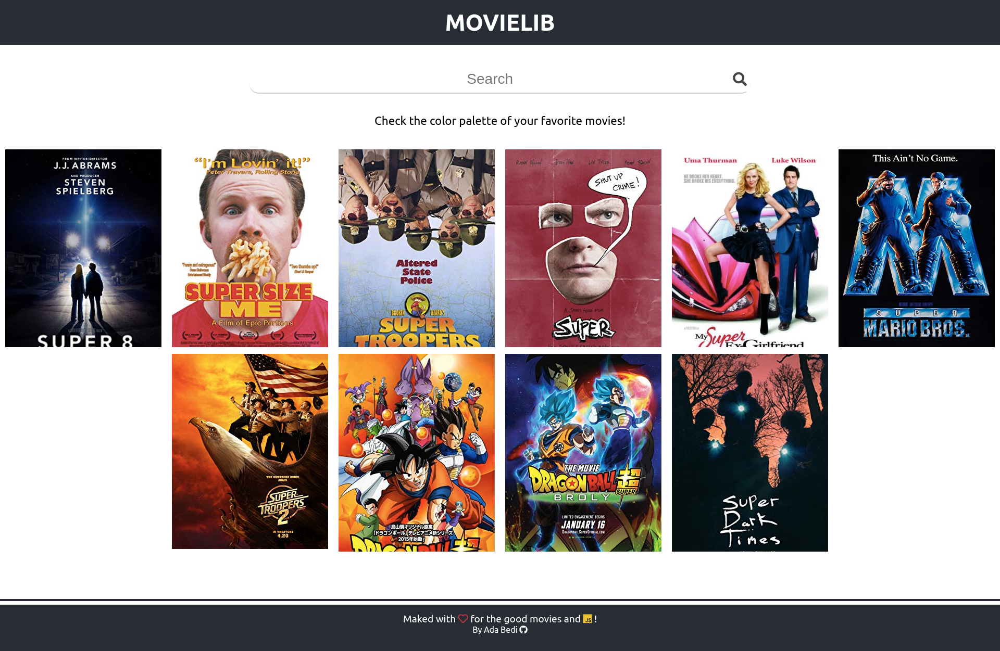
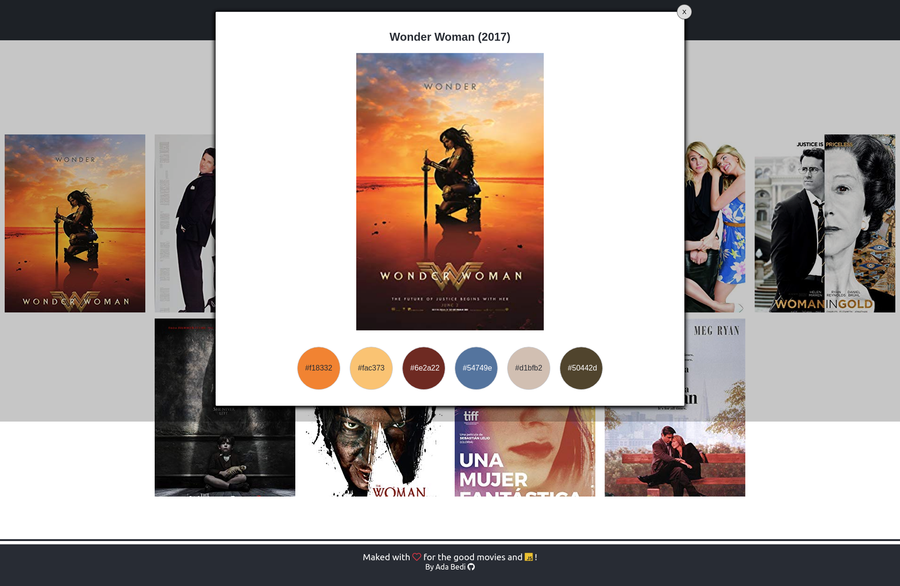
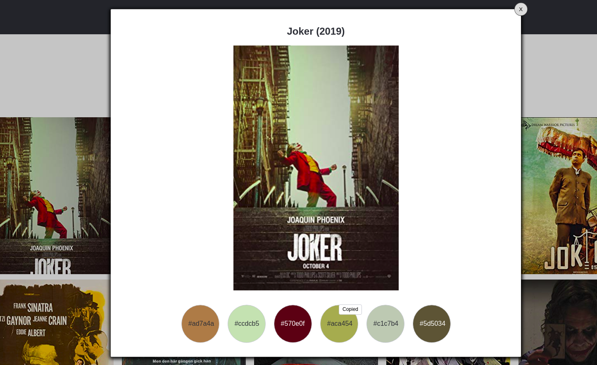
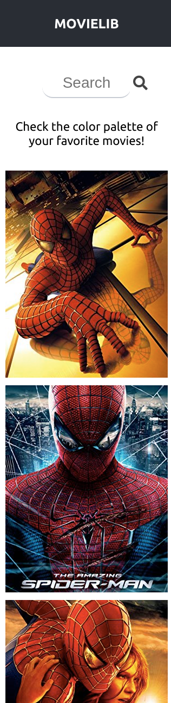

# Movies- Find out colors of your favorite movies

Simple saearch app created with React.js hooks and styled-components, consuming  omdb api.

## Table of Contents
* [General info](#general-info)
* [Technologies](#technologies)
* [Setup](#setup)
* [To do](#to-do)
* [Demo](#demo)
* [Status](#status)
* [Inspiration](#inspiration)

## General info
The application was created mainly as part of learning.
You can search for a poster of any movie from the omdb database and check what color palette dominates in a given poster ;)
The project will be developed with the option of filtering movies by colors.

## Technologies
* [JavaScrip](#setup) 
* [React.js](https://reactjs.org/)
* [styled-components](https://www.styled-components.com/)
* [react-palette](https://github.com/leonardokl/react-palette)
* [react-uid](https://github.com/thearnica/react-uid)

## Setup
Just visite https://adabedi.github.io/movies-palette
or
To run this project locally,
1. Add your app key, you can easily get one [here](https://www.omdbapi.com/), to the path:
/src/api/index.js
2. Install it locally using npm:
```
$ cd ../movies
$ npm install
$ npm start
```

And Enjoy It on https://localhost:3000

## To Do
* TypeScript
* Eslint
* Search filters by gender, etc.

## Demo
1. Nice looking!

  
 
2. Easy to copy color hex value, just one clik.
 

3. Mobile friendly.



## Status
Project is in progress.

## Inspiration
Movie search app inspired by [Samuel Omole](https://www.freecodecamp.org/news/how-to-build-a-movie-search-app-using-react-hooks-24eb72ddfaf7/)
Color Palette ideas inspired by [article](https://digitalsynopsis.com/design/color-palettes-famous-movies/)
